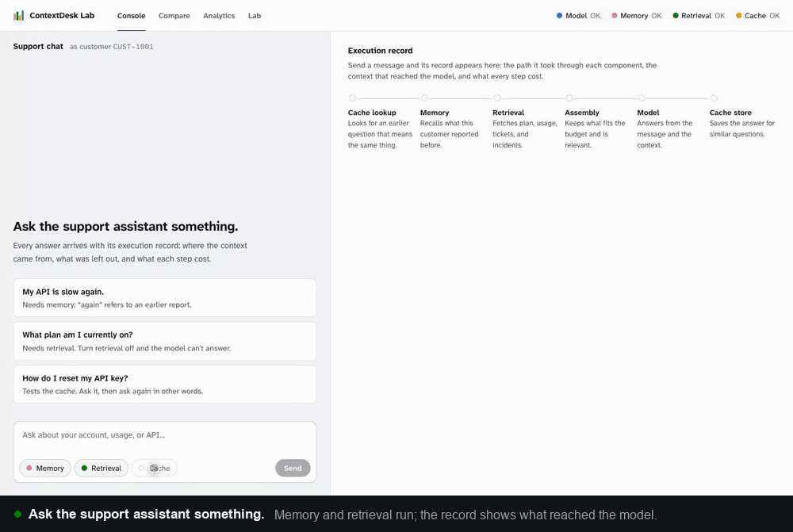
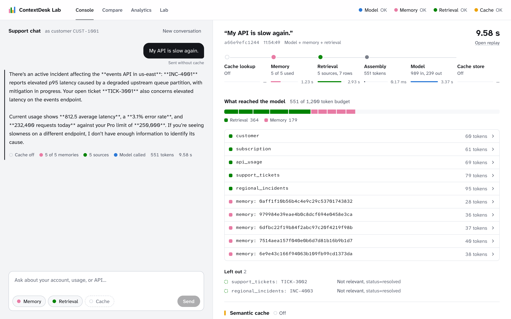
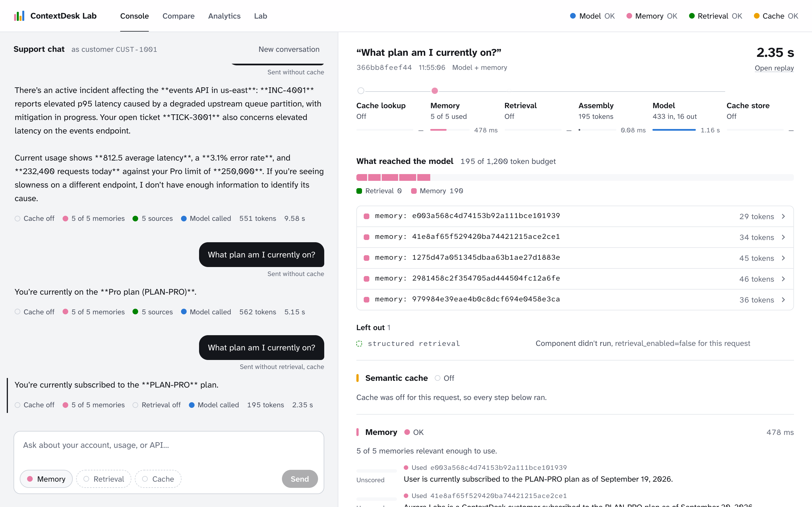
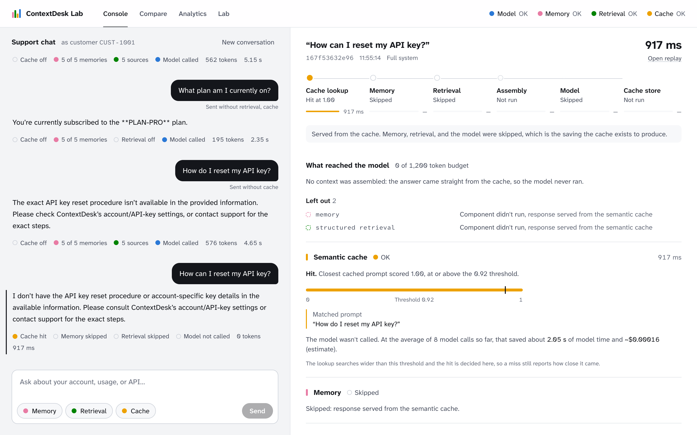
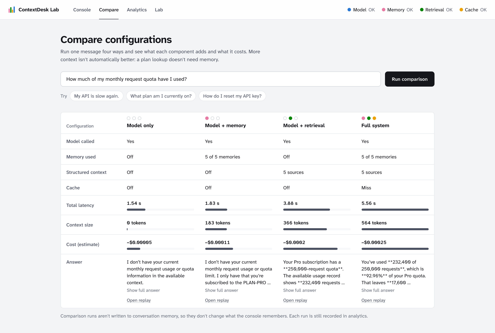
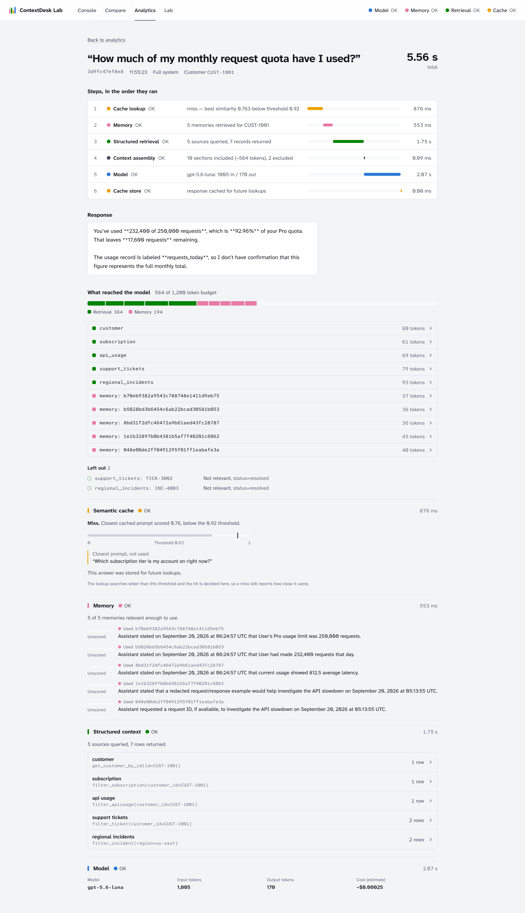

# ContextDesk Lab

An interactive context engineering playground for exploring
[Redis Iris](https://redis.io/). It looks like an AI support chat for a
fictional SaaS platform, but the chat is only the interface. The product is what
it makes visible: where each answer got its context, what was left out, whether
the cache answered instead of the model, and what every step cost.

> Every AI request produces two things: a user-facing response **and** an
> execution record. No component is ever hidden behind the chat, and none is
> ever reported as having worked when it didn't.



▶︎ **[Watch the full walkthrough](docs/media/demo.mp4)** (1 min 40 s) · 📖
**[Read the walkthrough, screen by screen](docs/WALKTHROUGH.md)**

## What you're looking at



The left half is a support chat. The right half is the record of the answer
beside it, and it is the reason the project exists:

- **The path.** Six steps in the order they ran — cache lookup, memory,
  retrieval, assembly, model, cache store — each with its status and its share
  of the total. Here: 9.58 s, of which memory was 1.23 s, retrieval 2.93 s and
  the model 3.37 s.
- **What reached the model.** 551 tokens of a 1,200-token budget, split 364
  retrieval against 179 memory, itemised source by source. Any row expands to
  the text that was actually sent.
- **What didn't.** Two records were fetched and dropped — `TICK-3002` and
  `INC-4003`, both *Not relevant, status=resolved*. Retrieval returned seven
  rows; five were used; the record says why the other two were not.

Three pills in the composer — Memory, Retrieval, Cache — are the execution
configuration for the next message. They travel with the request, so two
consecutive messages can run differently and both records stay honest about
which components they used.

## The three things it demonstrates

**Memory makes a sentence mean something.** *"My API is slow again."* has no
referent without the earlier conversation. Agent Memory supplies it, and the
inspector shows which five memories were used and what each one cost.

**Retrieval is the difference between an answer and a guess.**



Ask *"What plan am I currently on?"*, then switch Retrieval off and ask again:
the context drops from 562 tokens to 195, retrieval contributes **0**, and
*Left out* names the reason — `retrieval_enabled=false` for this request. (The
answer still lands, because memory happens to remember the plan from an earlier
conversation. The **Model only** column on Compare is where the question
genuinely fails.)

**The cache answers without the model, and says how close it came.**



*"How do I reset my API key?"* → 4.65 s, 576 tokens, model called.
*"How can I reset my API key?"* → **917 ms, 0 tokens, model not called**, with
the similarity plotted against the threshold and the matched prompt named. A
miss reports its score too: the lookup searches below the decision threshold on
purpose, because a miss with no score is the one thing this project can't
afford to hide.

## What's in the app

| Page | What it shows |
|---|---|
| **Console** | The support chat, and beside it the Context Inspector for the selected answer: the path through cache, memory, retrieval, and the model; what reached the model against its token budget; what was left out and why |
| **Compare** | One message run four ways (model only, plus memory, plus retrieval, full system), compared on latency, context size, and estimated cost |
| **Analytics** | Latency, cache, model, and context metrics, latency per request, and the request history. Any request replays step by step |
| **Lab** | One page each for Agent Memory, Context Retriever, and LangCache: why it exists, what it stores, how it's queried, its tradeoffs, and what it has done in your requests |

<table>
<tr>
<td width="50%"><a href="docs/WALKTHROUGH.md#6-compare--what-each-component-is-worth"></a></td>
<td width="50%"><a href="docs/WALKTHROUGH.md#8-replay--one-request-step-by-step"></a></td>
</tr>
<tr>
<td><b>Compare</b> — 1.54 s and 0 tokens for model only, up to 5.56 s and 564 tokens for the full system. More context isn't automatically better, and the table is where that stops being a slogan.</td>
<td><b>Replay</b> — every step with its timing, the cache's near miss, every memory with its text, and the retrieval calls with their arguments.</td>
</tr>
</table>

## Quick start

Requires Python 3.12 with [uv](https://docs.astral.sh/uv/), and Node.js 20.9 or
later.

```bash
cp .env.example .env          # optional; see Stub mode below
```

```bash
# Terminal 1 — backend on :8000
cd backend
uv sync
uv run fastapi dev app/main.py
```

```bash
# Terminal 2 — frontend on :3000
cd frontend
npm install
npm run dev
```

Open http://localhost:3000.

### With Docker

```bash
docker compose up --build     # backend on :8000, frontend on :3000
```

The backend reads the root `.env` at runtime; the keys are never copied into an
image. Without a `.env`, everything runs as a stub. The browser calls the
backend directly at `http://localhost:8000`, and that address is compiled into
the frontend bundle, so changing it means rebuilding the frontend image. The
seed scripts run inside the backend image too:

```bash
docker compose run --rm backend python -m app.data.seed_redis
docker compose run --rm backend python -m app.data.seed_memories
```

### Stub mode

No credentials are needed to run it. Any component whose keys are blank or
missing runs as an in-process stub: the LLM, LangCache, Agent Memory, and
Context Retriever each have one. Skipping `.env` entirely stubs everything. If
you copy `.env.example`, replace or blank its placeholder `OPENAI_API_KEY`;
otherwise the backend tries the real provider and reports the model as
unavailable. A stub is never reported as working. The header shows each
component as **OK** or **Stub**, and so does every execution record. The stub
LLM doesn't pretend to be a model: it answers by printing the context it was
handed.

- Add `OPENAI_API_KEY` and `LLM_MODEL` for real answers.
- Provision the three Iris services on Redis Cloud for the rest.
  [PLAN.md, Milestone 0](PLAN.md#milestone-0--provision-redis-iris) walks
  through it. Then load the synthetic data:

  ```bash
  cd backend
  uv run python -m app.data.seed_redis       # records Context Retriever reads
  uv run python -m app.data.seed_memories    # the demo's long-term memories
  ```

## Try the three scenarios

| Ask | What it demonstrates |
|---|---|
| "My API is slow again." | Memory: "again" only makes sense with the earlier latency report, which the inspector shows being used |
| "What plan am I currently on?" | Retrieval: turn Retrieval off in the message box and the structured record leaves the context; open Compare to see the question fail outright with no context at all |
| "How do I reset my API key?" | The semantic cache: ask it, then ask again in other words, and watch the similarity against the threshold and the model call it skipped |

The cache is persistent, so a question you've asked before is answered from the
cache before anything else runs. Turn the Cache pill off when you want to watch
another component work — then turn it back on and rephrase to see the hit.

## Documentation

| Document | Contents |
|---|---|
| [docs/WALKTHROUGH.md](docs/WALKTHROUGH.md) | A tour of the running app, screen by screen: how to read an execution record, the three scenarios, Compare, Analytics, Replay, and the Lab |
| [docs/ARCHITECTURE.md](docs/ARCHITECTURE.md) | How the system is put together and why: request flow, the four-state status, context assembly, telemetry, the frontend |
| [PLAN.md](PLAN.md) | The product spec, demo scenarios, and build sequence |
| [CLAUDE.md](CLAUDE.md) | Working conventions and Redis Iris API notes |

## Repository layout

```
backend/     FastAPI service: orchestration, the Iris clients and their stubs, telemetry
frontend/    Next.js app: console, compare, analytics, replay, lab
docs/        architecture, walkthrough, and the screenshots and demo recording
PLAN.md      product spec and build sequence
```

## Checks

```bash
(cd backend && uv run pytest)                                      # 50 tests, no network
(cd frontend && npm run lint && npx tsc --noEmit && npm run build)
```

## License

[MIT](LICENSE)
