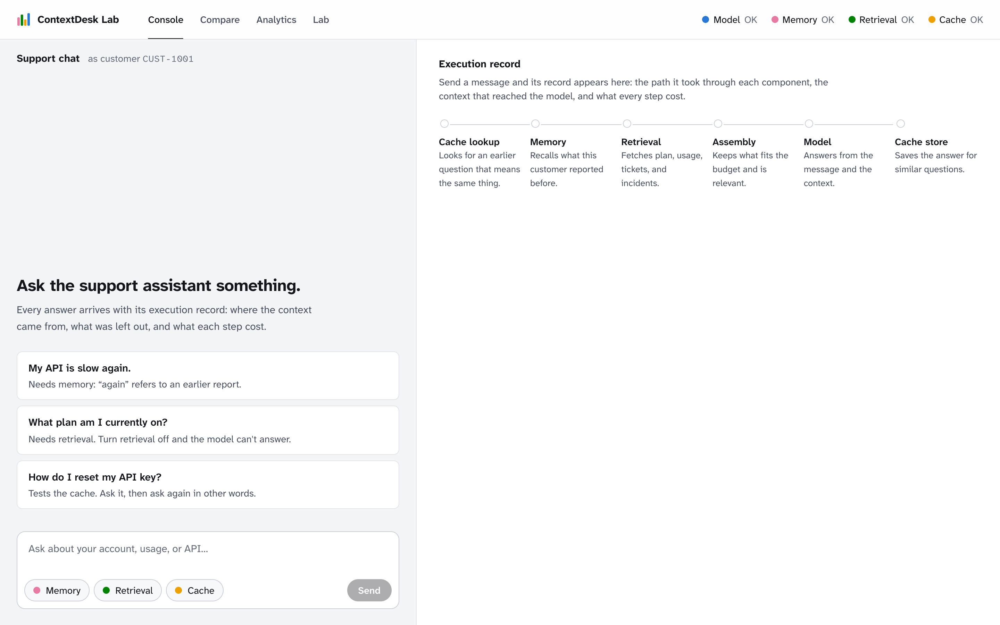
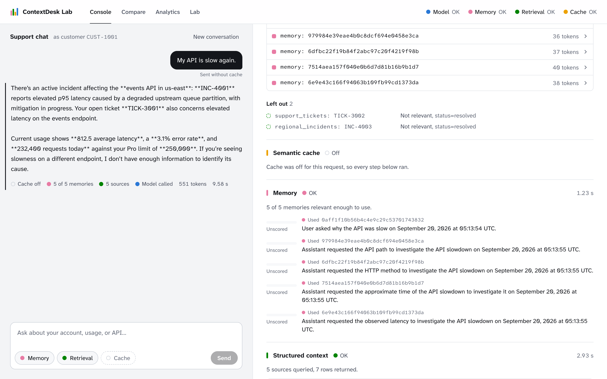
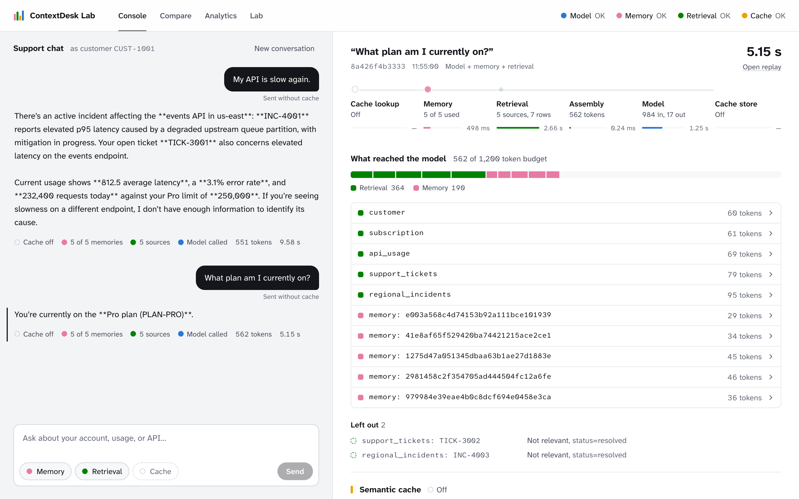
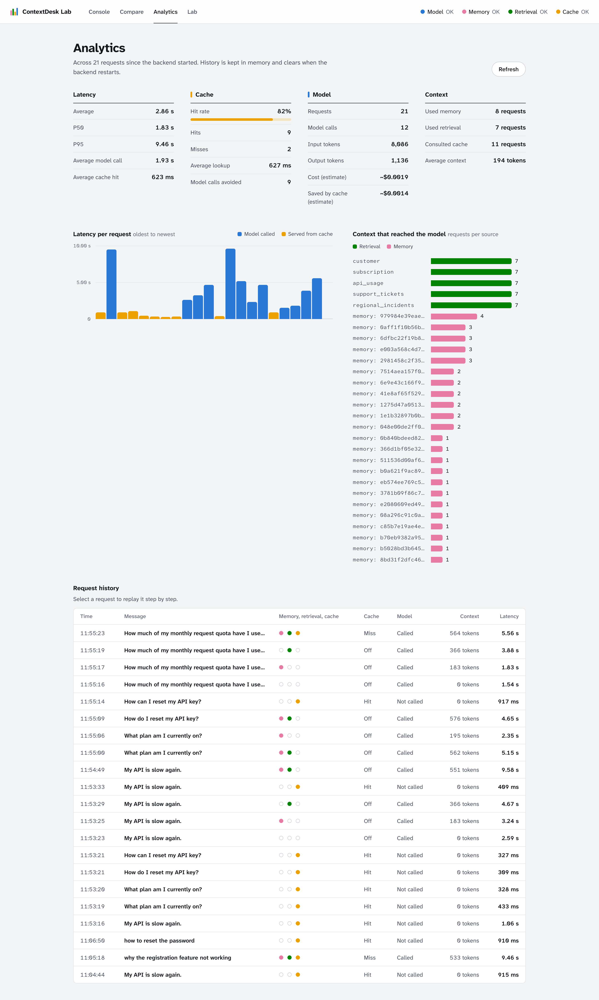
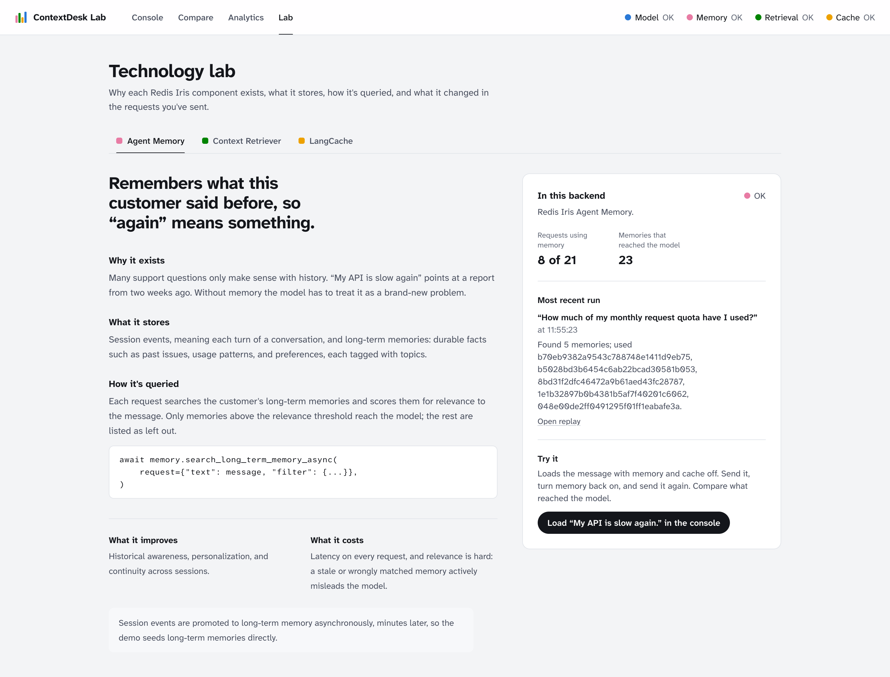
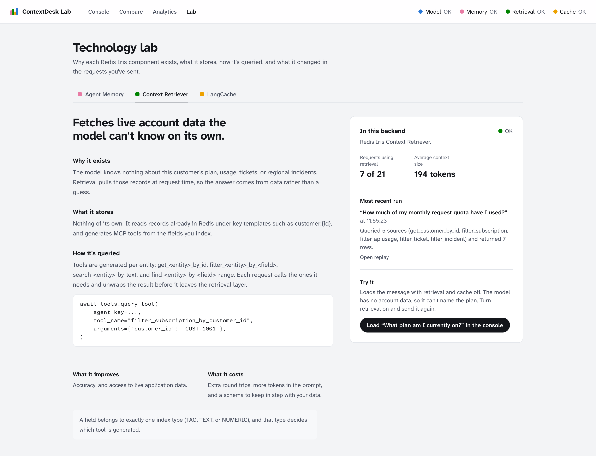
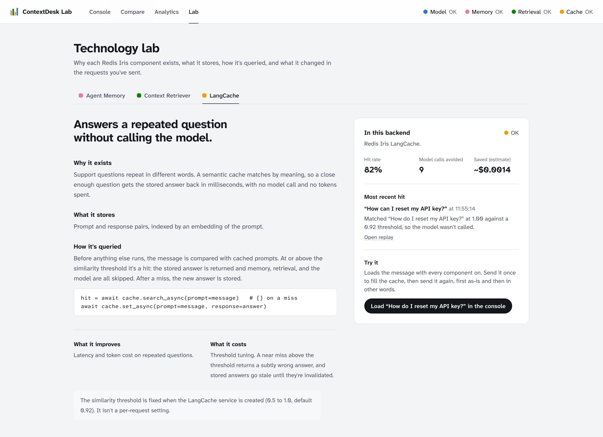

# ContextDesk Lab — A walkthrough

A guided tour of the running app: what each screen shows, and how to read the
numbers on it. Every screenshot here is a real request against real Redis Iris
services and a real model — nothing is mocked up for the documentation.

If you want the internals instead, read
[ARCHITECTURE.md](ARCHITECTURE.md). If you want to run it,
[the README](../README.md) has the quick start.

---

## The cast

Four components can take part in a request. Each one owns a colour, and that
colour follows it everywhere — the composer toggle, the inspector section, the
context budget bar, the analytics charts.

| Colour | Component | Redis Iris service | What it contributes |
|---|---|---|---|
| Pink | **Memory** | Agent Memory | What this customer said and was told before |
| Green | **Retrieval** | Context Retriever | Live account records: plan, usage, tickets, incidents |
| Amber | **Cache** | LangCache | A stored answer to a question that means the same thing |
| Blue | **Model** | The LLM | The answer itself |

Three of the four are switched per request. The model is not: without it there
is nothing to switch.

---

## 1. The console



The left half is an ordinary support chat, acting as customer `CUST-1001`. The
right half is the Context Inspector, empty until a message runs, showing the six
steps a request passes through in order: **cache lookup → memory → retrieval →
assembly → model → cache store**.

The three pills in the composer — Memory, Retrieval, Cache — are the execution
configuration for the *next* message. They are sent with the request, not held
as global state, so two consecutive messages can run under different
configurations and both records stay truthful about which one they used.

The header carries each component's health: **OK**, **Stub**, or
**Unavailable**. A stub is never reported as working.

---

## 2. Reading an execution record


This is the whole product in one screen. The message was *"My API is slow
again."* — a sentence that means nothing without the earlier conversation.

**The step waterfall.** Six steps, each with its status glyph, its outcome in
words, and its share of the 9.58 s total. Memory took 1.23 s, retrieval 2.93 s,
assembly 0.17 ms, the model 3.37 s. Cache lookup and cache store read **Off**,
because the cache pill was switched off for this message — that is a different
state from *Skipped*, and the UI keeps them apart.

**What reached the model.** 551 of a 1,200-token budget, split 364 tokens of
retrieval against 179 of memory, then itemised: five structured sources
(`customer`, `subscription`, `api_usage`, `support_tickets`,
`regional_incidents`) and five memories, each with its own token cost. Any row
expands to the text that was actually sent.

**Left out.** Two records were fetched and then dropped —
`support_tickets: TICK-3002` and `regional_incidents: INC-4003`, both *Not
relevant, status=resolved*. This is the half of context engineering that
normally leaves no trace: retrieval returned seven rows, five were used, and the
record says why the other two were not.



---

## 3. Scenario one — memory

> "My API is slow again."

"Again" is the whole test. The model has no way to resolve it; Agent Memory
does. Five long-term memories scored relevant enough to include, and the answer
comes back naming `INC-4001` and the customer's open ticket `TICK-3001`, with
the current 812.5 ms average latency and 3.1 % error rate from the usage record.

Memory and retrieval are both working here, and the record separates their
contributions rather than presenting one blended context.

---

## 4. Scenario two — retrieval

> "What plan am I currently on?"



With retrieval on, five sources are queried through generated MCP tools and 562
tokens of context reach the model in 5.15 s.

Now the same question with the Retrieval pill switched off:


The context collapses to 195 tokens, retrieval contributes **0**, and *Left out*
names the reason in the request's own vocabulary: *structured retrieval —
Component didn't run, `retrieval_enabled=false` for this request*.

The answer still names PLAN-PRO. That is worth sitting with: the answer survives
not because the model knew, but because **memory** happened to hold
*"User is currently subscribed to the PLAN-PRO plan as of September 19, 2026"*
from an earlier conversation — a fact that can go stale in a way the live
subscription record cannot. To see the question genuinely fail, use the
**Model only** column on the Compare page, where both memory and retrieval are
off.

---

## 5. Scenario three — the semantic cache


Two messages, asked four seconds apart:

| | "How do I reset my API key?" | "How can I reset my API key?" |
|---|---|---|
| Cache | Off for this message | **Hit at 1.00**, threshold 0.92 |
| Memory | 5 of 5 memories | Skipped |
| Retrieval | 5 sources | Skipped |
| Model | Called | **Not called** |
| Context | 576 tokens | 0 tokens |
| Latency | 4.65 s | **917 ms** |

The cache section shows the matched prompt, the similarity plotted against the
threshold, and the estimate of what the hit avoided: *"The model wasn't called.
At the average of 16 model calls so far, that saved about 1.80 s of model time
and ~$0.00016."*

A miss is reported just as carefully. The lookup deliberately searches below the
decision threshold, so a miss still knows how close it came — you will see
*"Miss. Closest cached prompt scored 0.76, below the 0.92 threshold"* with the
prompt it nearly matched. A cache that hides its near misses is a cache you
cannot tune.

---

## 6. Compare — what each component is worth


One message, run four ways. This is the page that resists the assumption that
more context is better.

| | Model only | Model + memory | Model + retrieval | Full system |
|---|---|---|---|---|
| Latency | 1.54 s | 1.83 s | 3.88 s | 5.56 s |
| Context | 0 tokens | 183 tokens | 366 tokens | 564 tokens |
| Cost | ~$0.00005 | ~$0.00011 | ~$0.0002 | ~$0.00025 |

For *"How much of my monthly request quota have I used?"*, the answers rank
differently from the costs. **Model only** and **Model + memory** both decline:
they have no usage figure. **Model + retrieval** answers from the usage record
for 2.3 s less than the full system. The extra memory in the fourth column buys
a more specific phrasing and little else — for this question. Ask
*"My API is slow again."* instead and the ranking inverts, because that question
is unanswerable without memory.

Every cell links to its own replay, so any number in the table can be opened and
inspected.

---

## 7. Analytics — the aggregate



Across 21 requests: 82 % cache hit rate, 9 model calls avoided, ~$0.0019 spent
and ~$0.0014 saved, P95 latency 9.46 s against a 623 ms average cache hit.

**Latency per request** colours each bar by what answered it — blue for a model
call, amber for a cache hit — so the shape of the chart is the cache's argument
for itself.

**Context that reached the model** counts how often each source was actually
used, not how often it was fetched. Five structured sources at 7 requests each,
then the memories, ranked.

**Request history** is the full log: message, which components were on, hit or
miss, called or not, context size, latency. Every row opens its replay.

History lives in the backend's memory and clears when the backend restarts.

---

## 8. Replay — one request, step by step


The same record as the inspector, laid out as a page you can link to.

The steps, in the order they ran:

| # | Step | Outcome | Time |
|---|---|---|---|
| 1 | Cache lookup | miss — best similarity 0.763 below threshold 0.92 | 876 ms |
| 2 | Memory | 5 memories retrieved for CUST-1001 | 553 ms |
| 3 | Structured retrieval | 5 sources queried, 7 records returned | 1.75 s |
| 4 | Context assembly | 10 sections included (~564 tokens), 2 excluded | 0.09 ms |
| 5 | Model | gpt-5.6-luna: 1005 in / 170 out | 2.07 s |
| 6 | Cache store | response cached for future lookups | 0.00 ms |

Below the steps: the response, the token budget, what was left out, the cache's
near miss with the prompt it nearly matched, every memory with its text, and the
retrieval calls with their arguments —

```
customer           get_customer_by_id(id=CUST-1001)          1 row
subscription       filter_subscription(customer_id=CUST-1001) 1 row
api usage          filter_apiusage(customer_id=CUST-1001)     1 row
support tickets    filter_ticket(customer_id=CUST-1001)       2 rows
regional incidents filter_incident(region=us-east)            2 rows
```

Those are real generated MCP tool names from the registered Context Retriever
surface. Note `filter_apiusage`, not `filter_api_usage`: the entity segment is
the class name lowercased, which is the kind of detail that costs an afternoon
if you infer it instead of reading the live schema.

---

## 9. Lab — what each component is, and what it just did

Three pages, one per Redis Iris service. Each is half explanation and half live
readout, so the claims are checked against your own requests.







Each page answers the same five questions — why it exists, what it stores, how
it's queried, what it improves, what it costs — with the actual call beside
them:

```python
await memory.search_long_term_memory_async(request={"text": message, "filter": {...}})
await tools.query_tool(agent_key=..., tool_name="filter_subscription_by_customer_id", ...)
hit = await cache.search_async(prompt=message)   # {} on a miss
```

The panel on the right is not documentation. It reads your telemetry: *7 of 21
requests used retrieval, average context 194 tokens*; *hit rate 82 %, 9 model
calls avoided, ~$0.0014 saved*; and the most recent run, with a link to its
replay. **Try it** loads the matching message into the console with the right
pills already set.

---

## 10. Reading the status glyphs

Status is carried by fill, never by hue — the hue always names the component.

| Glyph | Meaning |
|---|---|
| Solid | **OK** — the real service ran |
| Half-filled | **Stub** — the in-process fake ran, and is reported as a fake |
| Hollow | **Off** (you turned it off) or **Skipped** (a cache hit made it unnecessary) |
| Red cross | **Unavailable** — the component failed, and the request says so |

*Off* and *Skipped* are distinguished by reading the request's
`execution_config`, because "I turned this off" and "this didn't need to run"
teach different things.

---

## Reproducing these screenshots

The cache is persistent, so a question you have asked before will be answered
from the cache and none of the other components will run. To see memory and
retrieval work, switch the **Cache** pill off first — then switch it back on and
ask the same question in other words to see the hit.

That is the order used throughout this walkthrough:

1. Cache off. Ask *"My API is slow again."*
2. Ask *"What plan am I currently on?"*, then turn **Retrieval** off and ask it again.
3. Ask *"How do I reset my API key?"*, turn **Cache** back on, and ask *"How can I reset my API key?"*
4. Open **Compare** with a question you have not asked yet.
5. Open **Analytics**, then any row in the history.
